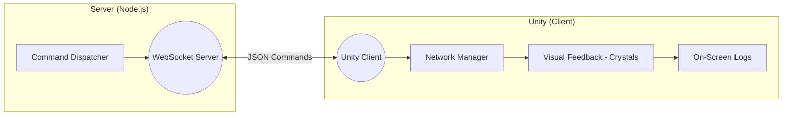

# 🎮 Unity & Node.js WebSocket Integration


> A bidirectional WebSocket communication system between a **Node.js Server** and a **Unity 3D Client** using WebSockets.
---

## 🏗️ Architecture Overview

The system follows a decoupled architecture where the server acts as the "Test Controller" and the Unity client acts as the "System Under Test" (SUT).



---

## 🛠️ Design Decisions

1. **Protocol (WebSockets over TCP):** Chosen for its low-latency, full-duplex nature. Unlike HTTP, WebSockets allow the server to "push" test commands to Unity without the client constantly polling.
2. **Directory Structure:** The project is strictly separated into `/Server` and `/Unity_Client` to ensure clean dependency management and to mimic real-world microservice environments.
3. **On-Screen UI Logger:** Instead of relying solely on the Unity Console (which is hidden in builds), I built an overlay UI logger. This makes the tool immediately useful for manual QA testers running the compiled game.
4. **Defensive Coding:** Every incoming message in Unity is wrapped in a `try-catch` block with JSON validation. If the server sends malformed data, the client logs a "Parse Error" instead of crashing a critical requirement for stable QA tools.
5. **Main Thread Dispatcher:** Since WebSocket events run on background threads, I implemented a `UnityMainThreadDispatcher` to ensure UI and visual updates (crystals) occur safely on Unity's main thread.

---

## 🚀 Installation & Setup

### 1. Server Setup (Node.js)

The server logic and dependencies are isolated within the /Server directory. Open your terminal in the root project folder and run:

```bash
# Navigate to the server directory
cd Server

# Install dependencies (ws, dotenv, jest, etc.)
npm install

# Run automated tests and generate HTML report
npm test

# Start the QA Server
npm start

```

### 2. Unity Client Setup

* **Unity Version:** Developed and tested on **Unity 2018.4.36f1** (LTS).
* **Option A (Quick Run - No Unity Required):** 
    1. Go to the **[Releases](https://github.com/Inbar-kr/Unity-NodeJS-QA-Automation/releases/tag/v1.0.0)** tab on the right side of this GitHub page.
    2. Download `Unity_Client_v1.0.zip` and extract it to a folder.
    3. Run `Unity_Client.exe`.
    *Note: Ensure the Node.js server is running first before launching the client to capture the initial handshake.*
* **Option B (Development Mode):** 
    1. Open the `Unity_Client` folder as a project in Unity.
    2. Load `Assets/Scenes/SampleScene.unity`.
    3. Press **Play**.
> 💡 **Usage Tip:** Once connected, you can use the **"Run Sequence"** button in the bottom-right corner of the Unity screen to re-trigger the test flow at any time.
---

## 🧪 Command Reference Table

The server automatically cycles through the following commands. The Unity client parses the JSON and provides visual feedback:

| Command (`action`) | Unity Visual Response | Expected Client Reply |
| --- | --- | --- |
| `System Standby` | 🔵 **Blue Crystal** Activated | `Action Executed: System Standby` |
| `Test Mode` | 🟣 **Purple Crystal** Activated | `Action Executed: Test Mode` |
| `Ad Delivered` | 🟢 **Green Crystal** Activated | `Action Executed: Ad Delivered` |
| `High Latency` | 🟡 **Yellow Crystal** Activated | `Action Executed: High Latency` |
| `Timeout Error` | 🔴 **Red Crystal** Activated | `Action Executed: Timeout Error` |

---

## 📊 Testing & Reporting

### 📝 Comprehensive Test Plan (QA Strategy)
A dedicated test plan was created to outline the testing strategy, including functional happy-paths, connectivity edge cases (e.g., network drops, handshake interruptions), and data integrity validation. 
👉 **[Read the full TEST_PLAN.md here](TEST_PLAN.md)**

### 🤖 Automated Integration Tests
The server includes automated integration tests using **Jest**. To enhance test visibility and provide a better QA experience, I implemented `jest-html-reporter`. 
After running `npm test`, a professional HTML report is generated at:

`Server/test-report.html`

It provides a visual breakdown of test durations and pass/fail status for the communication protocol.

---

## 🔍 Known Issues & Areas for Improvement 

* **Auto-Reconnect:** Currently, if the server restarts, the Unity client does not automatically attempt to reconnect.
* **Security:** The current WebSocket implementation is unencrypted (`ws://`). For production-level field testing, `WSS` (Secure WebSockets) should be implemented.
* **Schema Validation:** The Unity C# JSON parser blindly accepts the incoming data. Adding strict schema validation (checking for missing or malformed fields) would prevent potential runtime errors if the server sends corrupted JSON.

---

## 👤 Author

**Inbar Kehimker**

---
## 📝 Disclaimer

*This project was developed as a home assignment and serves as a personal portfolio piece. It is not intended for commercial use.*